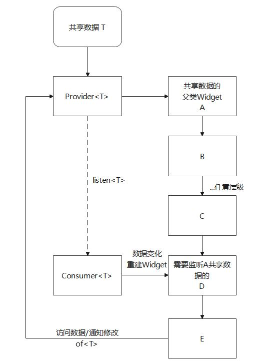
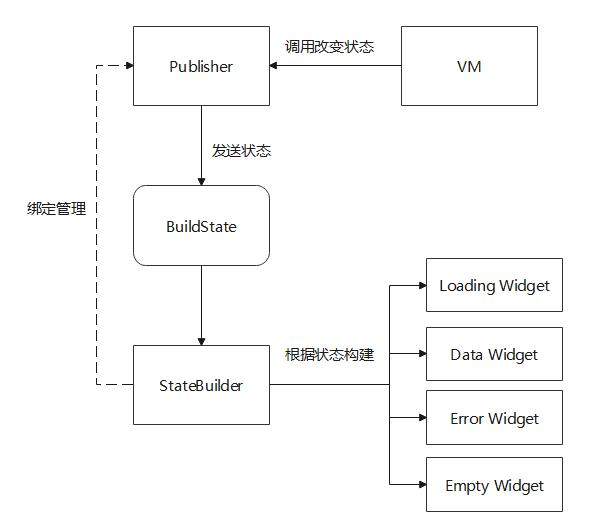
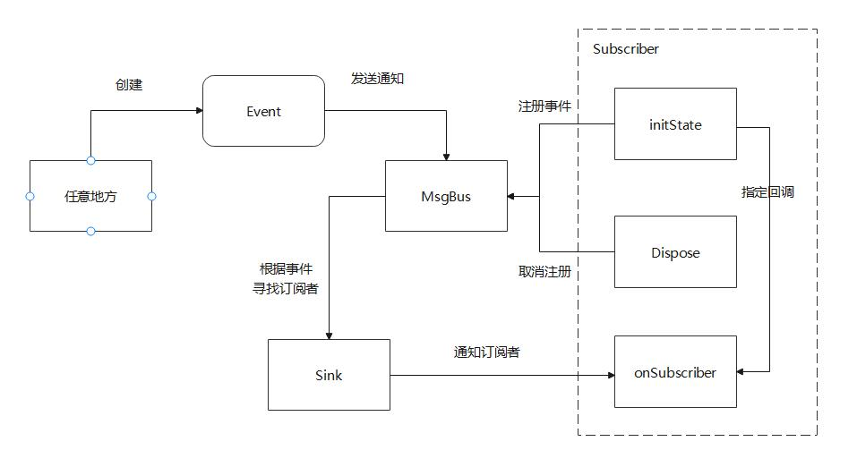

## Flutter状态管理套件

一套Flutter通用，支持空安全，适配flutter 3.0的状态管理套件，支持全平台的Flutter Package。

主要包括3个部分：
- 状态管理 Provider-Consumer
- 状态构建 Publisher-StateBuilder
- 消息总线 MsgBus

其中Consumer使用Publisher-StateBuilder实现

## 状态管理 Provider-Consumer

### 概要
状态管理主要用于解决多层Widget中，任意深度子Widget需要访问父Widget中的数据问题。
实现了父Widget数据共享，并且自动监听刷新子Widget状态。
其主要特性包括：
- 支持任意数据类型，甚至基础数据类型
- 不绑定父子Widget，最小化局部刷新
- 查找复杂度O(1)

***特别注意，不支持同级Widget数据共享***



### 使用指南

创建Provider：

```dart
// 要共享数据  
int counter = 0;

Provider(data: counter, child: YourFatherWidget());
```

需要监听子Widget：

```dart
Consumer<int>(builder: (context, value) {
  return Text(
    'Provider共享的数据是： $value',
  );
});
```

仅获取数据：

```dart
Provider.of<int>(context)?.data;
```

修改数据并发送通知：
```dart
Provider.of<int>(context)?.changeNotify(newData);
```


## 状态构建 Publisher-StateBuilder

### 概要
状态构建主要用于两种场景。需要处理网络状态的页面或者需要局部刷新的Widget。
其主要特性包括：
- 支持初始状态
- 支持安全通知（销毁后发送通知不会崩溃）
- 自动管理生命周期
- 多Publisher消息合并
- 轻量级，无需RxDart



### 使用指南

创建Publisher，此处以StatePublisher为例子
```dart
_publisher = StatePublisher(BuildState.loading);
```

创建StateBuilder
```dart
StateBuilder.fromState(
  publisher: _publisher,
  loading: (context) => const Text("加载中状态", style: TextStyle(fontSize: 20)),
  data: (context) => const Text("数据状态", style: TextStyle(fontSize: 20)),
  empty: (context) => const Text("空白状态", style: TextStyle(fontSize: 20)),
  error: (context) => const Text("错误状态", style: TextStyle(fontSize: 20)),
),
```

修改状态
```dart
_publisher?.notify(BuildState.data);
```

###合并Publisher消息

**注意合并的Publisher必须要一样。**

```dart
// 合并方法
Publisher.merge([_mergePublisher1, _mergePublisher2], initData: data);

// 示例
StateBuilder<int>(
  publisher: Publisher.merge([_mergePublisher1, _mergePublisher2], initData: data),
  builder: (context, data) {
    return Text( "$data", style: const TextStyle(fontSize: 20));
  }
);
```


## 消息总线 MsgBus

### 概要
消息总线主要用于发送消息场景。
其主要特性包括：
- 支持泛型
- 支持粘性事件



### 使用指南

第一步：定义事件类型
```dart
class MyEvent{}
```

第二步：注册事件订阅者（推荐放在initState方法中）
```dart
MsgBus.register(this, test);
void test(MyEvent e){
    print(e);
}
```

第三步：发送事件

```dart
MsgBus.post(MyEvent());
```

第四步：不要忘记取消订阅（推荐放在dispose方法中）

```dart
MsgBus.unRegister(this);
```

***关于Sticky事件***：

可以使用`postSticky`/`removeSticky`方法实现

## 更多使用方法
参考demo工程